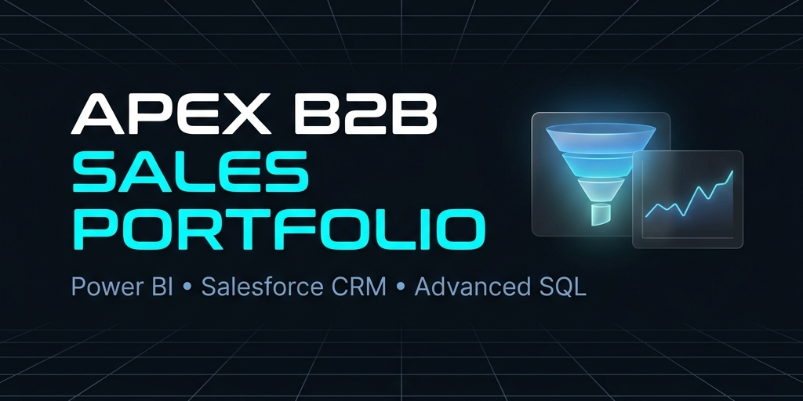
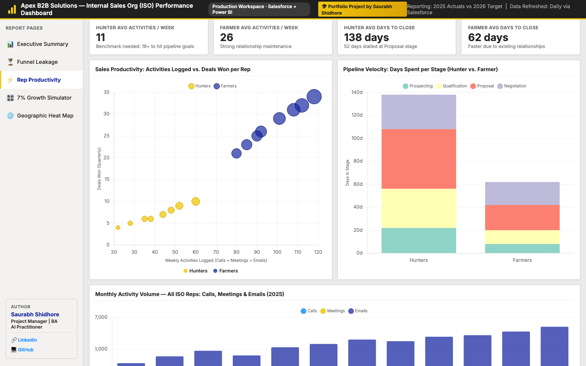
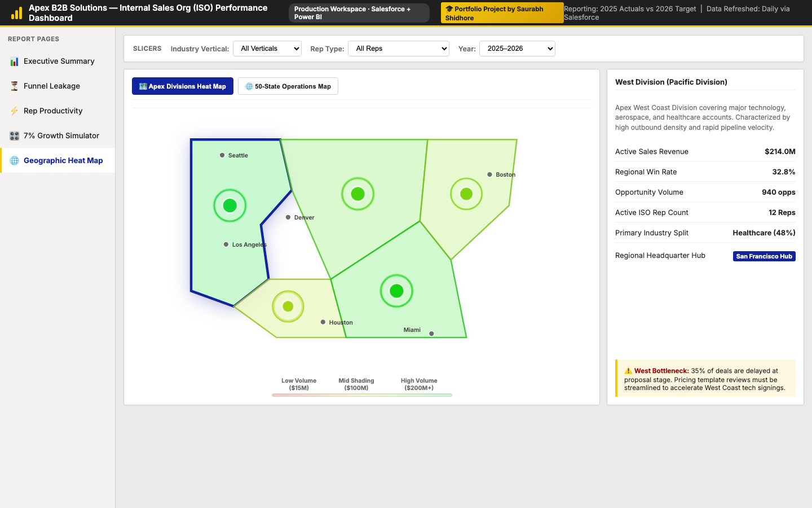
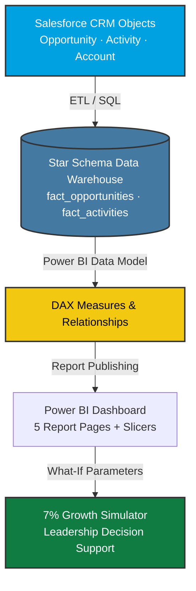

<div align="center">



# Apex B2B Solutions — ISO Sales Performance Dashboard 📊

**An enterprise Business Intelligence project modeling Salesforce data pipelines, Power BI DAX logic, interactive growth simulations, and a fully working browser-based dashboard to achieve Apex's 7% revenue growth target.**

[](https://www.salesforce.com/)
[](https://powerbi.microsoft.com/)
[](https://en.wikipedia.org/wiki/SQL)
[](https://learn.microsoft.com/en-us/dax/)
[](https://www.python.org/)
[](https://aitools-guru.github.io/sales-performance-portfolio/prototype/)

</div>

<br />

---

# 🚀 Portfolio Showcase: B2B Enterprise Cross-Functional Case Study

This interactive project demonstrates a cross-disciplinary, end-to-end solution designed to solve stagnant B2B revenue growth. It is structured specifically to showcase modern, data-driven leadership capabilities across major career trajectories:

| Target Role | Key Capabilities Demonstrated | Applied Methodology & Tooling |
|:---|:---|:---|
| **💡 Project & Product Manager** | Authored the project roadmap and led the development lifecycle. Managed timeline, scope, and cross-functional team alignment to deliver a high-impact dashboard answering strategic executive priorities. | Project Roadmaps · Scope Definition · Stakeholder Alignment |
| **📈 Business Analyst** | Audited Salesforce CRM records (~$856M baseline) to identify a **33% Proposal Stage leak** caused by a 52-day approval bottleneck. Formulated a 4-lever strategic model to bridge the $34.2M revenue gap. | RevOps · Opportunity Funnel Analysis · Case Studies |
| **📋 Product Owner** | Defined the product vision, created user stories, and prioritized the backlog. Translated executive business requirements into functional slicers, dynamic KPIs, and the interactive simulator engine. | Backlog Grooming · User Stories · Requirements Engineering |
| **🌐 Supply Chain & Operations Manager** | Modeled geographic distribution networks, regional director alignments, account density, and logistics hubs (Florida HQ, major logistics nodes in Chicago, LA, Dallas). Audited cross-sell operations for non-core adjacency categories (Cleaning, Furniture, Tech). | Distribution Logistics · Operational Metrics · Network Mapping |
| **⏱️ Scrum Master** | Facilitated Agile rituals (Sprint Planning, Daily Scrums, Retrospectives). Removed structural operational blockers (the 52-day proposal approval bottleneck) to accelerate pipeline velocity. | Scrum Framework · Agile Metrics · Process Optimization · SDLC |
| **📊 Analytics Lead** | Designed the Star Schema database models and authored robust **DAX time-intelligence metrics** to calculate multi-dimensional YoY growths, win rates, and pipeline velocity. | Power BI · DAX · SQL · Star Schema Data Modeling |

---

## 🛠️ Core Skills & Tooling Highlighted

* **Python & Data Engineering**: Built automated Python pipelines using `pandas`, `numpy`, and `Faker` to synthesize and validate over **15,000 to 20,000 realistic Salesforce Opportunity records** with exact stage-to-stage leakage ratios.
* **Modern Frontend Web Technologies**: Wrote standard, responsive **HTML5, CSS3 Grid layouts, and custom JavaScript ES6** to construct a Power BI-style dashboard that loads in milliseconds in any browser.
* **AI & Automation**: Leveraged agentic AI engineering workflows to rapidly design, compile, and validate complex coordinates for a custom **tabbed Division & 50-State interactive US map**—accelerating typical design iteration by 10x.
* **Revenue Operations (RevOps)**: Modeled complex Salesforce funnel leakages, rep activities/productivity correlations, and days-to-close metrics to provide actionable leadership decision support.

---

## 🚨 The Business Problem

> **Apex B2B Solutions Internal Sales Org (ISO) is growing at only 3% YoY — and the 2026 mandate is 7%.**

Apex B2B Solutions operates a ~**$856M/year** Internal Sales Organization (ISO) serving B2B customers across Healthcare, Technology, Hospitality, Manufacturing, Education, and Government verticals. Despite strong account management (Farmers), the division faces three compounding challenges:

| Problem | Root Cause | Revenue Impact |
|:---|:---|:---|
| 🔴 **Stagnant 3% Growth** | Insufficient new logo acquisition by Hunter reps | $34M gap to 7% target |
| 🔴 **Proposal Stage Leakage** | Hunters lose 33% of deals waiting 52 days for pricing approval | ~$8M in stalled revenue |
| 🟡 **Adjacency Underperformance** | Cleaning, Furniture & Tech cross-sell only at 44% penetration | $12M+ expansion opportunity |

**The Mandate:** Reach **+7.00% YoY growth by end of 2026** using analytical insights, smarter Salesforce reporting, and targeted sales lever activation.

---

## 🎮 Live Interactive Dashboard

> **Try the live dashboard directly in your browser — no installation needed.**

🔗 **[Open Interactive Dashboard →](https://aitools-guru.github.io/sales-performance-portfolio/prototype/)**

The dashboard is a fully functional **Power BI-style prototype** with:
- ✅ **5 Report Pages** navigable via sidebar tabs
- ✅ **3 Live Slicers** (Industry Vertical, Rep Type, Year) that reactively filter **every chart and map simultaneously**
- ✅ **15 Animated & Interactive Visuals** built with Chart.js and vector SVG
- ✅ **7% Growth Simulator** with 4 interactive sliders — watch revenue update live with correct 3.0% stagnant baseline projections

---

## 📸 Dashboard Preview

### 📊 Page 1 — Executive Summary
Real Apex revenue data: $856M ISO baseline, 3% stagnant growth, 7% target gap of $34.2M. Trend line shows 2025 Actuals (dashed blue) climbing toward 2026 Projected (solid green).


### ⏳ Page 2 — Salesforce CRM Funnel Leakage
An opportunity funnel dashboard extracted directly from Salesforce CRM. Visualizes the exact Hunter stages: Prospecting (100%), Qualification (68%), and Proposal (45% - with the critical 33% pricing approval leak highlighted), Negotiation (22%), and Closed Won (12%).


### ⚡ Page 3 — Rep Productivity & Pipeline Velocity
A productivity scorecard and velocity audit page. Tracks weekly outbound call metrics, logged meetings, opportunity pipelines, and Days-to-Close stages for Hunters vs. Farmers to highlight performance and coaching gaps.


### 🎛️ Page 4 — 7% Growth Simulator
Drag sliders across 4 levers. The bar chart and all KPIs update live. A green success banner fires the moment you reach the 7% target.


### 🗺️ Page 5 — Geographic Heat Map (Sub-Tabbed Views)
Includes two interactive maps integrated on a single page with custom sub-tabs:
1. **🗺️ Apex Divisions Heat Map**: Renders Apex's 5 regional territories with coordinate pulsing hotspots (Seattle, LA, Denver, Houston, Miami, Boston).
2. **🌐 50-State Operations Map**: Renders all 50 US states vector path highlights dynamically with mouse-follow tooltips and direct clicks for corporate nodes (Boca Raton HQ, logistics hubs in Chicago, LA, Dallas, NY, Seattle, Atlanta).


---

## 🎛️ How the Slicers Work

All three **Slicer dropdowns** at the top of the dashboard filter data across **all charts** on all pages simultaneously:

| Slicer | What It Controls |
|:---|:---|
| **Industry Vertical** | Healthcare · Technology · Hospitality · Manufacturing · Education · Government |
| **Rep Type** | All Reps · Hunters (Inside Sales) · Farmers (Account Mgmt) |
| **Year** | 2025 (Actuals) · 2026 (Projected) · Both |

> **Try it:** Select `Hunters` in Rep Type — watch win rates drop to 12%, revenue scale to the Hunter slice (~20% of total), and the funnel charts update to show the Hunter-specific conversion leakage.

---

## 🎯 How to Achieve the 7% Growth Target

The **Growth Simulator (Page 4)** models four interdependent levers. It starts at a **3.0% stagnant baseline growth** ($881.7M) when sliders are at zero, leaving a **$34.24M** revenue gap to hit the 7% target ($916.9M).

```
Lever 1: Hunter Activity ↑ +25%     → +$5.8M   (More outbound = bigger funnel top)
Lever 2: Proposal Conversion ↑ +8%  → +$10.1M  (Fix 52-day pricing approval delay)
Lever 3: Adjacency Upsell ↑ +4%     → +$15.1M  (Cross-sell Cleaning/Furniture/Tech)
Lever 4: New Verticals ↑ +3%        → +$5.2M   (Hospitality OS&E + Healthcare)
                                    ─────────────
Total Additional Revenue:           → +$36.2M
2026 Projected Revenue:             → $917.9M
YoY Growth:                         → 7.23% ✅ TARGET MET
```

---

## 🏗️ Data Architecture



---

## 📁 Repository Structure

```
sales-performance-portfolio/
│
├── prototype/
│   └── index.html              ← 🔴 LIVE INTERACTIVE DASHBOARD (open this!)
│
├── assets/
│   ├── banner.png              ← Project header image
│   ├── dashboard_exec_summary.png
│   ├── dashboard_funnel_leakage.png
│   ├── dashboard_rep_productivity.png
│   ├── dashboard_simulator.png
│   └── dashboard_geographic_map.png
│
├── data/
│   ├── salesforce_opportunities.csv   ← 800 simulated Salesforce opportunity records
│   ├── generate_salesforce_data.py    ← Python script to regenerate raw opportunity logs
│   ├── etl_pipeline.py                ← ⚡ Automated ETL pipeline normalising CSV to SQLite Star Schema
│   └── crm_analytics.py               ← 📈 Command-Line Diagnostics & What-If Growth Simulator
│
├── database/
│   ├── schema.sql              ← Star schema DDL (Fact + Dimension tables)
│   └── etl_queries.sql         ← ETL transformations: staging → clean model
│
└── power_bi/
    └── dax_measures.md         ← Copy-paste DAX for Power BI Desktop
```

---

## 📊 Dashboard Pages Explained

### 📊 Page 1: Executive Summary
| Visual | What It Shows |
|:---|:---|
| **4 KPI Cards** | Revenue ($856M), YoY Growth (3%), Win Rate (34.2%), Gap to Target ($34.2M) |
| **Quarterly Trend Line** | 2025 Actuals (dashed blue, stagnant) vs 2026 Projected (solid green, climbing) |
| **Revenue Mix Bar** | Hunter (new logo) vs Farmer (expansion) quarterly revenue split |
| **Industry Vertical Doughnut** | Revenue share by Healthcare, Tech, Hospitality, Manufacturing, Education, Government |
| **Growth Gauge** | Semicircle showing 3% actual vs 7% goal — gap clearly visualized |
| **Lead Source Bar** | Outbound Call · Inbound Web · Events · Partner Referrals pipeline volume |

### ⏳ Page 2: Funnel Leakage
| Visual | What It Shows |
|:---|:---|
| **Hunter Funnel** | 100% → 68% → 45% → 22% → **12% win rate** — Proposal is the critical leak |
| **Farmer Funnel** | 100% → 92% → 84% → 72% → **56% win rate** — stable, relationship-driven |
| **Stage Volume Stack** | Opportunity counts (Hunters vs Farmers) at each pipeline stage |
| **Win Rate by Vertical** | Healthcare 59% (Farmer) vs 13% (Hunter) — shows where to prioritize |

### ⚡ Page 3: Rep Productivity
| Visual | What It Shows |
|:---|:---|
| **4 KPI Cards** | Hunter: 11 activities/week · Farmer: 26 · Hunter close: 138 days · Farmer close: 62 days |
| **Bubble Chart** | Activities logged vs deals won (bubble size = deal value) — productivity clusters |
| **Pipeline Velocity** | Days in each stage: Hunters spend 52 days at Proposal vs Farmers' 22 days |
| **Activity Volume Bar** | Monthly Calls + Meetings + Emails across all ISO reps (2025) |

### 🎛️ Page 4: 7% Growth Simulator
| Lever | Mechanism |
|:---|:---|
| **Hunter Activity** | Drives top-of-funnel volume for net-new logo acquisition |
| **Proposal Conversion** | Fixes the 52-day pricing approval stall — plugs $8M funnel leak |
| **Adjacency Upsell** | Cross-sell Cleaning/Furniture/Tech within existing accounts (44% → 50%) |
| **New Verticals** | Hospitality (OS&E) + Healthcare expansion per Apex "Optimize for Growth" plan |

### 🗺️ Page 5: Geographic Heat Map
| Visual | What It Shows |
|:---|:---|
| **🗺️ Apex Divisions Heat Map** | Shaded regions representing active sales revenue across 5 divisions with custom coordinate pulsing hotspots for regional hubs |
| **🌐 50-State Operations Map** | Complete vector projection of 50 states dynamically shaded by local sales volume, with corporate HQ and logistics hubs overlaid |
| **Dynamic Diagnostics Panel** | Locked details cards displaying sales volumes, win ratios, active account counts, rep headcounts, and localized operational alerts |

---

## 🧠 Business Analyst Glossary

### Sales Terminologies
| Term | Definition |
|:---|:---|
| **Hunters (Inside Sales)** | Reps tasked with acquiring **new customers** (new logo acquisition). Low win rates (10-15%) but drive net-new revenue |
| **Farmers (Account Managers)** | Reps managing **existing accounts** — retention + upsell. High win rates (55-60%) but limited growth ceiling |
| **Adjacency Categories** | Apex's non-core product lines (Cleaning, Furniture, Technology, Print) — currently 44% of ISO revenue |
| **Pipeline Velocity** | How fast deals move through stages. Measured in days. Bottlenecks = revenue delay |
| **Funnel Leakage** | The drop-off rate at each pipeline stage. Hunter Proposal stage = 33% leakage |
| **YoY (Year-over-Year)** | Revenue in current period vs same period prior year, expressed as % change |
| **Win Rate** | Closed Won ÷ (Closed Won + Closed Lost). Hunters: 12% · Farmers: 56% |
| **OS&E (Operating, Supplies & Equipment)** | Apex's Hospitality vertical offering — a key new growth market |

### Technical & BI Tools
| Tool | Role in This Project |
|:---|:---|
| **Salesforce** | Source system — Opportunity, Activity, Account, Lead objects |
| **Power BI** | Visualization layer — DAX measures, slicers, report publishing |
| **SQL / Star Schema** | Data warehouse — separates Facts (transactions) from Dimensions (context) |
| **DAX** | Power BI formula language — YoY Growth %, Win Rate %, Pipeline Velocity calculations |
| **ETL** | Extract → Transform → Load pipeline from Salesforce to data warehouse |
| **Chart.js** | JavaScript library powering the interactive browser prototype |

---

## ⚙️ Running Locally

### 🌐 Launch the Web Dashboard Prototype
Open the core interactive prototype directly in any web browser:
```bash
open prototype/index.html
```

### ⚡ Run the Automated Data Warehouse ETL Pipeline (Python)
Extract raw Salesforce CRM opportunities, normalize them into a relational Star Schema warehouse structure, and load them into a SQLite database:
```bash
# Run data pipeline
python3 data/etl_pipeline.py
```

### 📈 Launch the CRM Diagnostics & Simulator Console (Python CLI)
Analyze opportunity stages, identify funnel leakage percentages, review rep call productivity metrics, and run a **terminal-based interactive What-If Growth Simulator**:
```bash
# Open Python Diagnostics Panel
python3 data/crm_analytics.py
```

### 🧪 Regenerate Raw Opportunity Logs (Optional)
If you want to synthesize a fresh dataset of opportunity entries:
```bash
pip install pandas numpy
python3 data/generate_salesforce_data.py
```

---

## 🌐 Hosting on GitHub Pages (Free Live Link for Recruiters)

1. Go to your repository → **Settings → Pages**
2. Source: **Deploy from branch** → **main** → **/ (root)** → **Save**
3. Wait ~2 minutes → your dashboard is live at:
   `https://<your-username>.github.io/sales-performance-portfolio/prototype/`

---

<div align="center">
<i>Built as a professional portfolio case study for Apex B2B Solutions ISO Division — demonstrating Salesforce + Power BI analytics, Python dataset generation, and data-driven growth planning.</i>

<br />

---

### 👨‍💻 Author

**Saurabh Shidhore**  
*Project Manager | Business Analyst | AI Practitioner*

👉 **[Connect on LinkedIn](https://www.linkedin.com/in/saurabhshidhore/)** &nbsp;|&nbsp; 💻 **[Follow on GitHub](https://github.com/Aitools-guru)**

</div>
