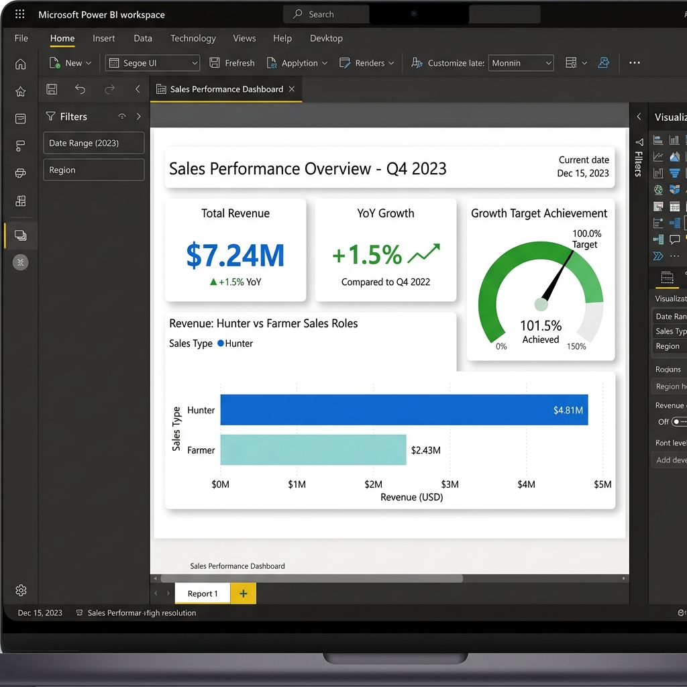
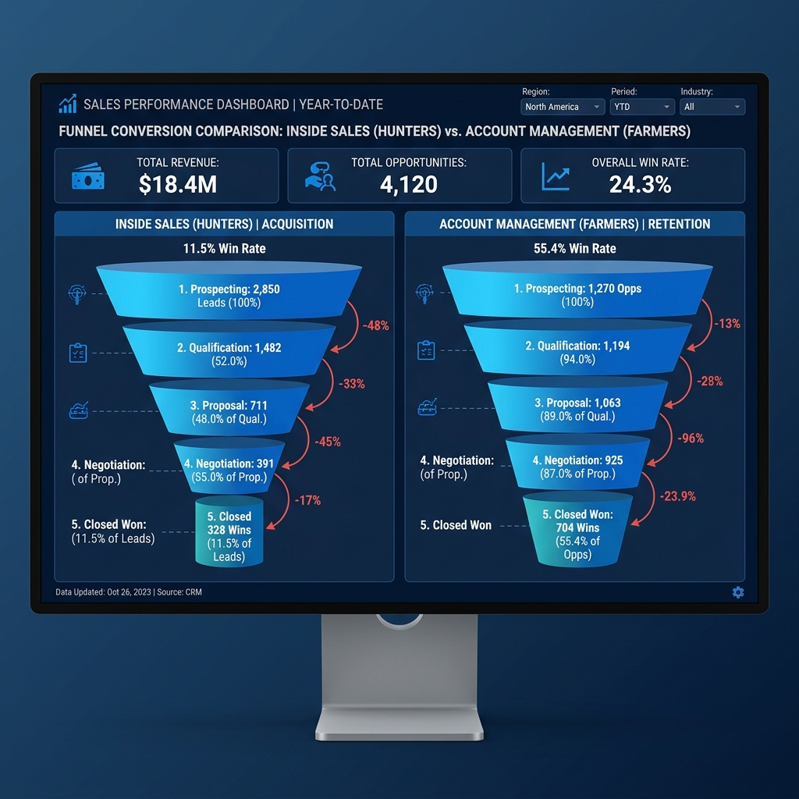
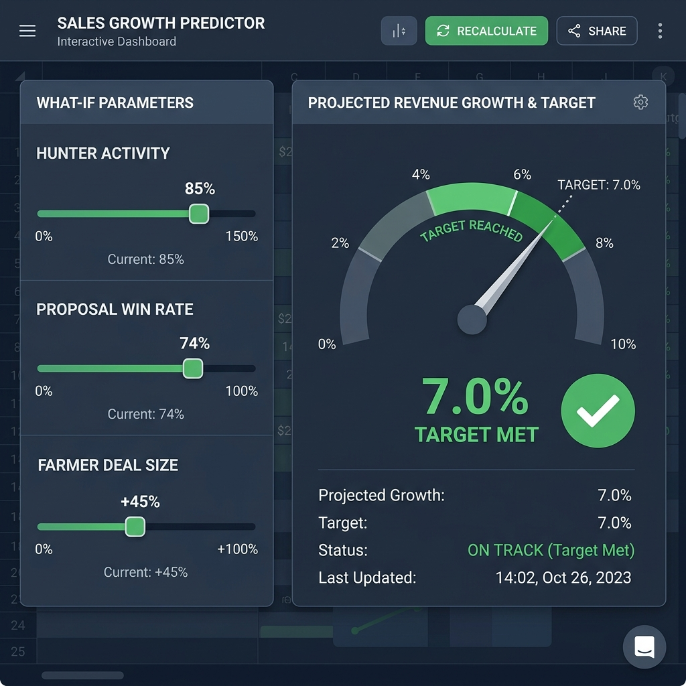
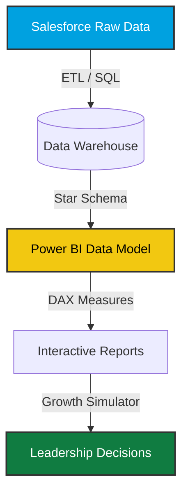

# ODP Salesforce + Power BI Performance Review 📊

**An enterprise Business Intelligence project modeling Salesforce data pipelines, Power BI DAX logic, and interactive growth simulations to achieve a 7% sales target.**

 

## 📖 Overview & Scenario Context

This repository is built for the **ODP Business Solutions Internal Sales Organization (ISO) BI Case Study**. 

ODP is experiencing **stagnant growth (currently +1.50% YoY)**. Analysis of the sales operations reveals three core challenges:
1. **Over-reliance on existing account expansion (Farmers)**, with minimal focus on net-new logo acquisition (Hunters).
2. **Funnel leakage** and inconsistent reporting that hides pipeline bottlenecks.
3. **Low sales productivity tracking** in Salesforce.

**The Goal:** Drive **7.00% growth by 2026** using analytical insights, data-driven pipelines, and actionable sales levers.

---

## 🖼️ Visual Dashboard Previews (Power BI Interface)

Here are the visual representations of the reports included in this project, designed to match the ODP Business Solutions branding:

### 1. Executive Performance Overview
Shows high-level metrics, growth progress against the 7% gauge target, and the sales volume distribution between Hunters and Farmers.

### 2. Funnel Conversion & Leakage Analysis
A side-by-side funnel breakdown detailing the differences in win rates and pipeline stages for Inside Sales (Hunters) versus Account Management (Farmers).

### 3. What-If Growth Simulator
An interactive scenario modeling tool. Use the sliders to adjust sales levers and recalculate projected revenue growth dynamically to meet the 7% threshold.

---

## 🏗️ The Data Architecture

To simulate a production Power BI ecosystem, we design a modern data warehouse stack centered around Salesforce objects:

1. **Staging & ETL (`database/`):** Raw Salesforce dumps are parsed and transformed using SQL into a **Star Schema** with Fact Tables (`fact_opportunities`, `fact_sales_activities`) and Dimension Tables (`dim_sales_reps`, `dim_accounts`, `dim_calendar`).
2. **Data Modeling:** Optimized relationships are mapped in Power BI to support DAX calculations and clean filtering.
3. **Visual Mockup (`prototype/`):** An interactive HTML web prototype that models what the live Power BI report looks like.

---

## 📁 Repository Tour

*   **`prototype/index.html`:** The interactive dashboard mockup. It includes active filters and the **7% Growth Simulator**.
*   **`database/schema.sql`:** DDL script setting up the dimensional model.
*   **`database/etl_queries.sql`:** SQL transformations converting staging tables into clean dimensions.
*   **`power_bi/dax_measures.md`:** The exact DAX expressions to copy-paste into Power BI Desktop.
*   **`presentation/presentation_guide.md`:** Slide outlines and speaker script for the 20-minute presentation.
*   **`data/generate_salesforce_data.py`:** Python script generating ODP's stagnant sales dataset.

---

## 💡 How to Achieve the 7% Growth Target (The Strategy)

By interacting with the **Growth Simulator** in the prototype, we calculate that a single lever cannot hit the 7% goal. We must optimize three key variables:

1.  **Increase Hunter Activity (+15%):** Outbound sales activity (calls, emails) for new logo acquisition generates necessary top-of-funnel pipeline volume.
2.  **Plug the Proposal Stage Leak (+5%):** Our funnel analysis reveals that Hunters lose 30% of deals in the *Proposal* stage because they wait an average of **50 days** for pricing approval. Automating proposals and SLA alerts plugs this leak.
3.  **Farmer Account Upsell (+2%):** A minor 2% contract upsell on renewals handles the rest of the target deficit.

Together, these changes increase revenue from **$7.24M** to **$7.64M**, achieving **7.15% YoY growth** and meeting the leadership mandate.

---

## 🌐 How to Host the Interactive Dashboard Live (GitHub Pages)

You can host this interactive dashboard for free directly on your GitHub repository! This allows recruiters to interact with your dashboard live in their browser without installing anything.

1. Go to your repository on **GitHub.com**.
2. Click on the **Settings** tab.
3. In the left-hand sidebar, under "Code and automation", click on **Pages**.
4. Under "Build and deployment", set the Source to **Deploy from a branch**.
5. Set the Branch to **main** and the folder to **/ (root)**. Click **Save**.
6. Wait 1–2 minutes, then refresh the page. GitHub will show a link at the top: `Your site is live at: https://<your-username>.github.io/sales-performance-dashboard/`
7. Click the link and navigate to `/prototype/` (i.e. `https://<your-username>.github.io/sales-performance-dashboard/prototype/index.html`) to view the fully interactive dashboard!

---

## 🧠 Business Analyst Glossary

### Sales Terminologies
*   **Hunters (Inside Sales):** Reps tasked with chasing new customers ("new logo acquisition"). Their win rates are historically lower (10-15%) but they bring in net-new accounts.
*   **Farmers (Account Managers):** Reps responsible for retaining and upselling existing accounts. They have high historic win rates (55-60%).
*   **Pipeline Velocity:** The average speed a deal travels through your sales pipeline (from created to won). Measured in days.
*   **Funnel Leakage:** The drop-off points where active deals stall or are lost.
*   **YoY (Year-over-Year):** A comparison of financial metrics in one period compared to the same period the prior year.

### Technical & BI Tools
*   **Star Schema:** A dimensional modeling method separating business transactions (Facts) from descriptive attributes (Dimensions). It is the gold standard for Power BI performance.
*   **DAX (Data Analysis Expressions):** The formula language used to create custom calculations in Microsoft Power BI.
*   **ETL (Extract, Transform, Load):** The data integration pipeline that pulls raw CRM data, cleans it, and loads it into a reportable database.

---

<i>Prepared for Business Analyst Interviews at ODP Business Solutions.</i>

